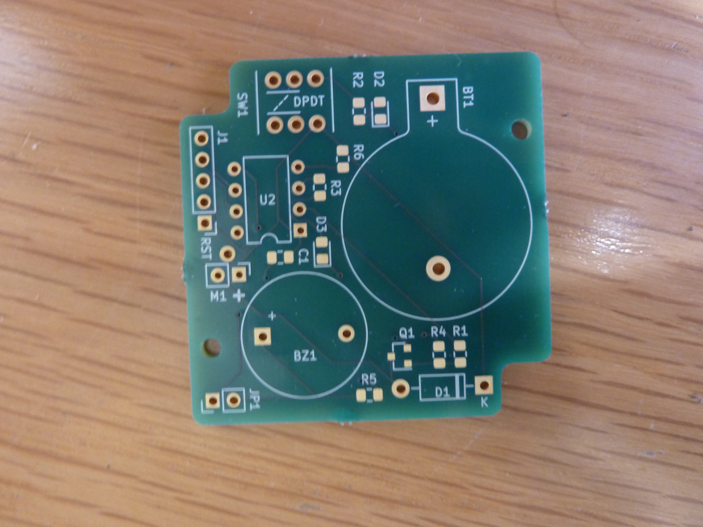

# Hammond-1551R

A DXF file of a pcb outline to fit inside a [Hammond Manufacturing][1]
1551R enclosure.

Tested with a fabricated pcb designed in [KiCad][2].

Import graphics 1551R.dxf to Edge.Cuts layer at a fixed location, then
import graphics 1551R-head.dxf to F.Fab layer at that same
location. The two can then be moved together as a block to where they
are needed. 1551R-head.dxf gives a generous visual indication of where
the screw heads will be. Not a proper keep-out zone, but good enough for me.

[1]: https://www.hammfg.com/electronics/small-case/plastic/1551
[2]: https://www.kicad.org/
